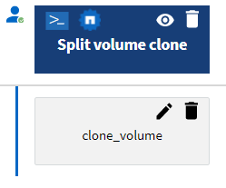

= どの承認ポイントがあるか
:allow-uri-read: 
:icons: font
:imagesdir: ../media/

[role="lead"]
承認ポイントは、ワークフローでワークフローの実行を一時停止し、ユーザーの承認に基づいて再開するために使用されるチェックポイントです。

次の図に示す青色の垂直バーは承認ポイントです。

承認ポイントを使用して、ワークフローのセクションを特定の条件が満たされた後にのみ実行する必要がある場合に、ワークフローの段階的な実行を行うことができます。たとえば、次のセクションが承認される必要がある場合や、最初のセクションが正常に実行されたことが確認された場合などです。承認ポイントでは、ワークフローの一時停止と再開の間のプロセスは処理されません。E メール通知と SNMP 通知は、 WFA 設定で指定されているように送信されます。ワークフローの一時停止通知を受信すると、ストレージオペレータに特定の操作を実行するよう求められます。たとえば、ストレージオペレータは、承認のために計画の詳細を管理者、承認者、オペレータに送信し、承認を受け取った時点でワークフローを再開できます。

承認が必要になることはありません。一部のシナリオでは、承認が必要になるのは、特定の条件が満たされ、承認ポイントが追加されたときに条件を設定できる場合だけです。たとえば、ボリュームのサイズを拡張するワークフローを考えてみましょう。ワークフローの開始時に承認ポイントを追加すると、ボリュームサイズの増加によってボリュームを含むアグリゲートのスペースが 85% 使用された場合に、ストレージオペレータが承認を得ることができます。ワークフローの実行中およびこの条件になるボリュームの選択中に、承認されるまで実行は停止されます。

承認ポイントに設定された条件には、次のいずれかのオプションがあります。

* 条件なし
* 指定した変数が見つかった場合
* 指定した変数が見つからない場合
* 指定した式が true と評価されます

ワークフロー内の承認ポイントの数に制限はありません。ワークフローのコマンドの前に承認ポイントを挿入し、承認ポイントの後にコマンドを設定して、実行前に承認を待つことができます。承認ポイントは、変更時刻、ユーザー、コメントなどの情報を提供します。これにより、ワークフローの実行が一時停止または再開された日時と理由を確認できます。承認ポイントのコメントには、 MVEL 式を含めることができます。

== 定義済みワークフローの承認ポイントの例

Designer で次の定義済みワークフローを開いて、承認ポイントの使用方法を理解できます。

* clustered Data ONTAP ボリュームを削除
* HA ペアのコントローラとシェルフのアップグレード
* ボリュームをマイグレートする

